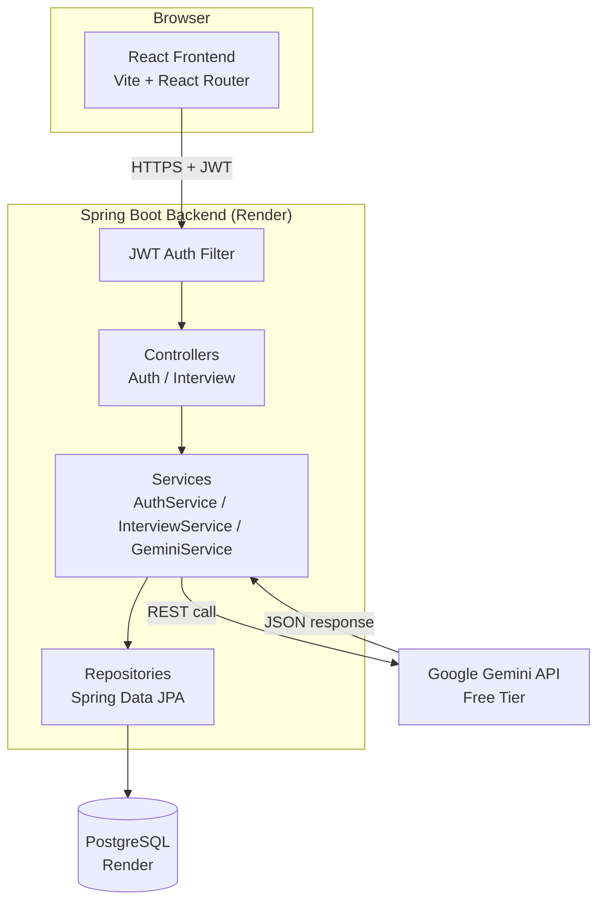
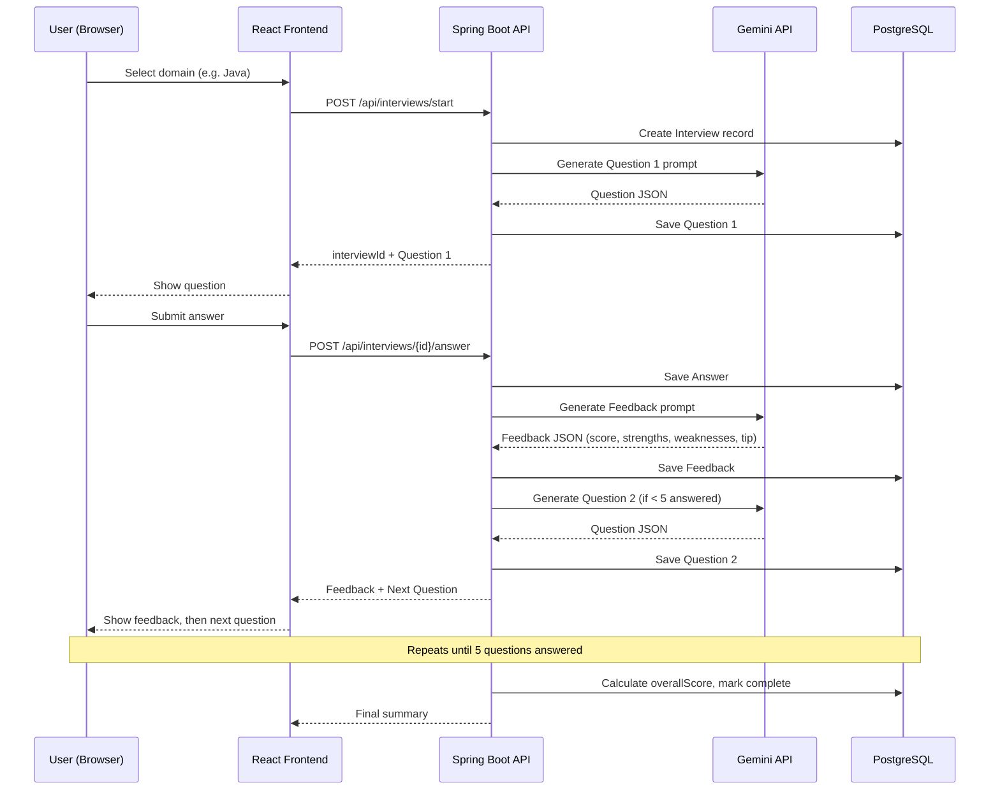
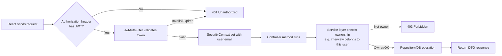
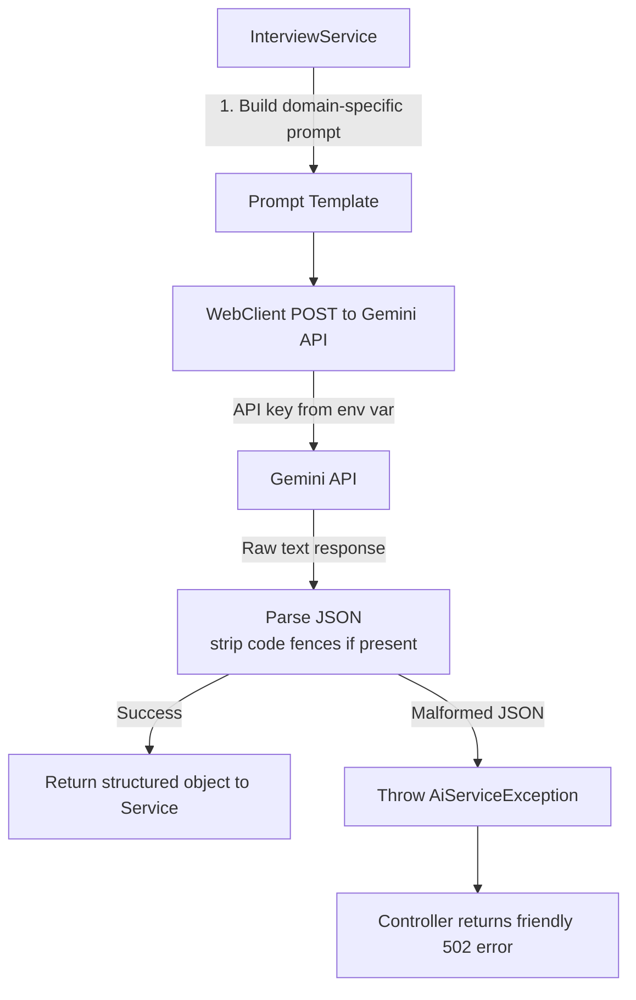

# PrepAI — System Architecture

**Status:** Finalized Day 2. This document is the technical backing for the PRD and Implementation Blueprint — no scope beyond what those documents define.

---

## 1. Tech Stack (Finalized)

| Layer | Choice | Justification |
|---|---|---|
| Frontend | React (Vite) | Locked Day 1 for resume value and learning goal; Vite gives a faster dev loop, useful on a 3–4 hr/day budget. |
| Backend | Java 17 + Spring Boot 3 | Locked Day 1 — primary skill-building goal. Layered architecture (Controller → Service → Repository) fits the PRD's maintainability requirement directly. |
| Database | PostgreSQL | Relational data model fits the domain (Users, Interviews, Questions, Answers, Feedback are clearly related records). Industry-standard, strong Spring Data JPA support. |
| Authentication | Spring Security + JWT (stateless) | Avoids server-side session storage — simpler to run on a free-tier host with no sticky-session requirements. |
| AI Model/API | Google Gemini API (free tier) | Free, no card required, generous daily quota, plain REST — callable from Spring Boot via `WebClient` without a special SDK. |
| Hosting — Backend | Render (free tier) | Supports Java/Spring Boot web services; auto-deploys from GitHub; no card required. Re-verified on Day 8. |
| Hosting — Database | Render PostgreSQL (free tier) | Same-provider hosting with the backend avoids cross-provider SSL/network friction for a first deployment. |
| Hosting — Frontend | Netlify or Vercel (free tier) | Both auto-deploy static React builds from GitHub for free. Final pick confirmed Day 8. |
| Version Control | Git + GitHub | Already in use. |
| API Testing | Postman | Used Days 3–6 to test backend endpoints before the frontend exists. |

---

## 2. Component Diagram



---

## 3. Data Flow — Full Interview Session



---

## 4. Request Lifecycle (Any Protected Endpoint)



---

## 5. AI Interaction Detail



**Prompt design principles:**
- Every prompt explicitly requests **strict JSON output only** (no markdown fences, no preamble).
- Question prompts include the domain and previously asked questions (to reduce repeats).
- Feedback prompts include the exact question and the user's exact answer, and request `score` (0–10), `strengths`, `weaknesses`, `improvementTip` as JSON keys.
- Parsing includes a fallback that strips ` ```json ` fences before parsing, since models sometimes wrap JSON anyway.

---

## 6. External Services

| Service | Purpose | Failure Handling |
|---|---|---|
| Google Gemini API | Question generation, answer feedback | `AiServiceException` → clean 502 response to frontend; frontend shows a retry message (Day 9 hardening) |
| Render (backend + DB hosting) | Runs backend + PostgreSQL | Free-tier cold starts are expected and documented; not a bug |
| Netlify / Vercel (frontend hosting) | Serves React static build | Minimal failure surface — static hosting only |

---

## 7. Security Notes

- Passwords hashed with BCrypt — never stored or logged in plain text.
- JWT signing secret stored as an environment variable, never committed to Git.
- Gemini API key stored as an environment variable, never committed to Git.
- CORS explicitly scoped to the deployed frontend origin (plus `localhost:5173` for local dev) — not left open (`*`).
- Every interview-related endpoint checks that the requesting user owns the resource before returning data (prevents ID-guessing attacks).
