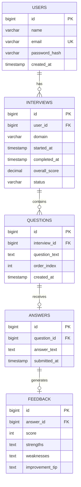

# PrepAI — Database Schema

**Database:** PostgreSQL
**Status:** Finalized Day 2 — validated against every user story in the PRD.

---

## 1. Entity-Relationship Diagram

---

## 2. Table Definitions

### `users`
| Field | Type | Constraints |
|---|---|---|
| id | BIGSERIAL | PRIMARY KEY |
| name | VARCHAR(100) | NOT NULL |
| email | VARCHAR(255) | NOT NULL, UNIQUE |
| password_hash | VARCHAR(255) | NOT NULL |
| created_at | TIMESTAMP | NOT NULL, DEFAULT now() |

### `interviews`
| Field | Type | Constraints |
|---|---|---|
| id | BIGSERIAL | PRIMARY KEY |
| user_id | BIGINT | FOREIGN KEY → users(id), NOT NULL |
| domain | VARCHAR(50) | NOT NULL, CHECK IN ('JAVA', 'DSA', 'WEB_DEVELOPMENT') |
| started_at | TIMESTAMP | NOT NULL, DEFAULT now() |
| completed_at | TIMESTAMP | NULLABLE |
| overall_score | DECIMAL(4,2) | NULLABLE — set only when status = COMPLETED |
| status | VARCHAR(20) | NOT NULL, DEFAULT 'IN_PROGRESS', CHECK IN ('IN_PROGRESS', 'COMPLETED') |

### `questions`
| Field | Type | Constraints |
|---|---|---|
| id | BIGSERIAL | PRIMARY KEY |
| interview_id | BIGINT | FOREIGN KEY → interviews(id), NOT NULL |
| question_text | TEXT | NOT NULL |
| order_index | INT | NOT NULL, CHECK BETWEEN 1 AND 5 |
| created_at | TIMESTAMP | NOT NULL, DEFAULT now() |

Additional constraint: `UNIQUE(interview_id, order_index)` — prevents two questions occupying the same slot in a session.

### `answers`
| Field | Type | Constraints |
|---|---|---|
| id | BIGSERIAL | PRIMARY KEY |
| question_id | BIGINT | FOREIGN KEY → questions(id), NOT NULL, UNIQUE (one answer per question) |
| answer_text | TEXT | NOT NULL |
| submitted_at | TIMESTAMP | NOT NULL, DEFAULT now() |

### `feedback`
| Field | Type | Constraints |
|---|---|---|
| id | BIGSERIAL | PRIMARY KEY |
| answer_id | BIGINT | FOREIGN KEY → answers(id), NOT NULL, UNIQUE |
| score | INT | NOT NULL, CHECK BETWEEN 0 AND 10 |
| strengths | TEXT | NOT NULL |
| weaknesses | TEXT | NOT NULL |
| improvement_tip | TEXT | NOT NULL |

---

## 3. Relationships Summary

- One `user` → many `interviews`
- One `interview` → many `questions` (fixed at 5 per completed session)
- One `question` → zero or one `answer` (zero while unanswered, one after submission)
- One `answer` → zero or one `feedback` (set immediately after AI evaluates the answer)

All child records cascade-delete is **not** enabled by default — if a user is deleted, related records should be handled explicitly in the service layer (out of scope for v1.0, since account deletion isn't a v1.0 feature).

---

## 4. Schema Validation Against PRD User Stories

| PRD Requirement (Section 6) | Schema Coverage |
|---|---|
| 6.1 Authentication | `users` table: email uniqueness, hashed password |
| 6.2 Domain Selection | `interviews.domain`, constrained to the 3 approved domains |
| 6.3 Mock Interview Module | `questions` table, ordered per interview, capped at 5 |
| 6.4 AI Feedback & Scoring | `feedback` table (score, strengths, weaknesses, tip), `interviews.overall_score` |
| 6.5 Dashboard | Derived via aggregate queries over `interviews` (average score, per-domain breakdown) |
| 6.6 Interview History | `interviews` joined with `questions` → `answers` → `feedback` |
| 6.7 Responsive UI | N/A — frontend concern, not a schema concern |

**Result:** No gaps. No fields added beyond what v1.0 features require (e.g., no `profile_picture`, no `subscription_tier` — those belong to Future Scope, not this schema).
