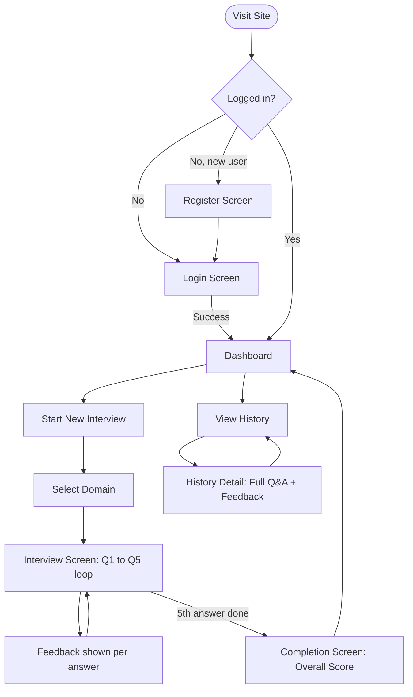

# PrepAI — UI & User Flow

**Status:** Finalized Day 2. Every screen below traces directly to a PRD v1.0 feature — nothing added beyond scope.

---

## 1. User Flow Diagram



---

## 2. Screen Inventory — Every Screen Justified

| Screen | PRD Section It Fulfills |
|---|---|
| Register | 6.1 Authentication |
| Login | 6.1 Authentication |
| Dashboard | 6.5 Dashboard |
| Domain Select | 6.2 Domain Selection |
| Interview (question + inline feedback) | 6.3 Mock Interview Module, 6.4 AI Feedback & Scoring |
| Completion | 6.4 AI Feedback & Scoring (overall score) |
| History List | 6.6 Interview History |
| History Detail | 6.6 Interview History |

No settings, profile, or admin screens — not part of v1.0 scope.

---

## 3. Low-Fidelity Wireframes

### 3.1 Login Screen
```
+----------------------------------+
|              PrepAI               |
|                                    |
|   Email     [____________________]|
|   Password  [____________________]|
|                                    |
|            [   Log In   ]         |
|                                    |
|   Don't have an account? Register |
+----------------------------------+
```

### 3.2 Register Screen
```
+----------------------------------+
|              PrepAI               |
|                                    |
|   Name      [____________________]|
|   Email     [____________________]|
|   Password  [____________________]|
|                                    |
|            [  Register  ]         |
|                                    |
|   Already have an account? Log In |
+----------------------------------+
```

### 3.3 Dashboard
```
+-----------------------------------------------------+
| PrepAI     Dashboard | History          [Logout]     |
+-----------------------------------------------------+
|  Welcome back, Divya                                 |
|                                                       |
|  [ Total Interviews: 6 ]  [ Avg Score: 7.1 / 10 ]     |
|                                                       |
|  Score by Domain                                     |
|  Java   [#######   ] 7.5                              |
|  DSA    [######    ] 6.2                              |
|  WebDev [########  ] 7.8                              |
|                                                       |
|          [  Start New Mock Interview  ]               |
+-----------------------------------------------------+
```

### 3.4 Domain Select
```
+-----------------------------------------------------+
|  Choose a domain to practice                         |
|                                                       |
|   [   Java   ]   [   DSA   ]   [  Web Development  ]  |
+-----------------------------------------------------+
```

### 3.5 Interview Screen (question state)
```
+-----------------------------------------------------+
|  Question 3 of 5                          [Java]      |
|                                                       |
|  "Explain the difference between an interface        |
|   and an abstract class in Java."                    |
|                                                       |
|  [__________________________________________]         |
|  [__________________________________________]         |
|                                                       |
|                    [ Submit Answer ]                  |
+-----------------------------------------------------+
```

### 3.6 Interview Screen (feedback state, same screen)
```
+-----------------------------------------------------+
|  Score: 7 / 10                                        |
|  Strengths: Clear on syntax differences                |
|  Weaknesses: Missed multiple inheritance use case        |
|  Tip: Mention default methods in Java 8+ interfaces     |
|                                                       |
|                    [ Next Question ]                  |
+-----------------------------------------------------+
```

### 3.7 Completion Screen
```
+-----------------------------------------------------+
|              Interview Complete!                      |
|                                                       |
|            Overall Score: 7.4 / 10                   |
|                                                       |
|      [ View Full Summary ]   [ Back to Dashboard ]    |
+-----------------------------------------------------+
```

### 3.8 History List
```
+-----------------------------------------------------+
| Date         Domain      Score       |                |
| Jul 20       Java        7.4          [ View ]        |
| Jul 19       DSA         6.0          [ View ]        |
+-----------------------------------------------------+
```

### 3.9 History Detail
```
+-----------------------------------------------------+
|  Interview — Java — Jul 20 — Score 7.4/10             |
|                                                       |
|  Q1: What is a HashMap collision...                   |
|  Your answer: ...                                     |
|  Feedback: Score 7 — Strengths / Weaknesses / Tip      |
|                                                       |
|  Q2: ... (repeats for all 5 questions)                 |
+-----------------------------------------------------+
```

---

## 4. Navigation Rules

- Top nav bar (Dashboard | History | Logout) is visible on all screens **except** during an active interview session, to keep focus on the task.
- Domain Select → Interview → Completion is a strictly linear flow; users cannot skip ahead or go back mid-session.
- Any protected screen redirects to Login automatically if the session/token has expired (built Day 4).
- Completion screen offers two exits: view the full summary (→ History Detail) or return to Dashboard.
