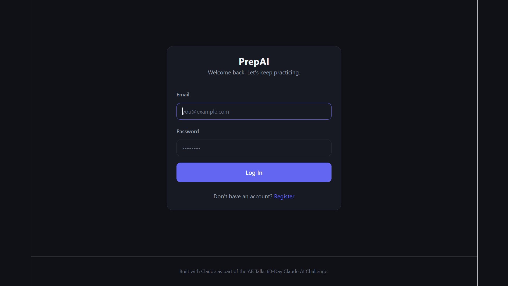
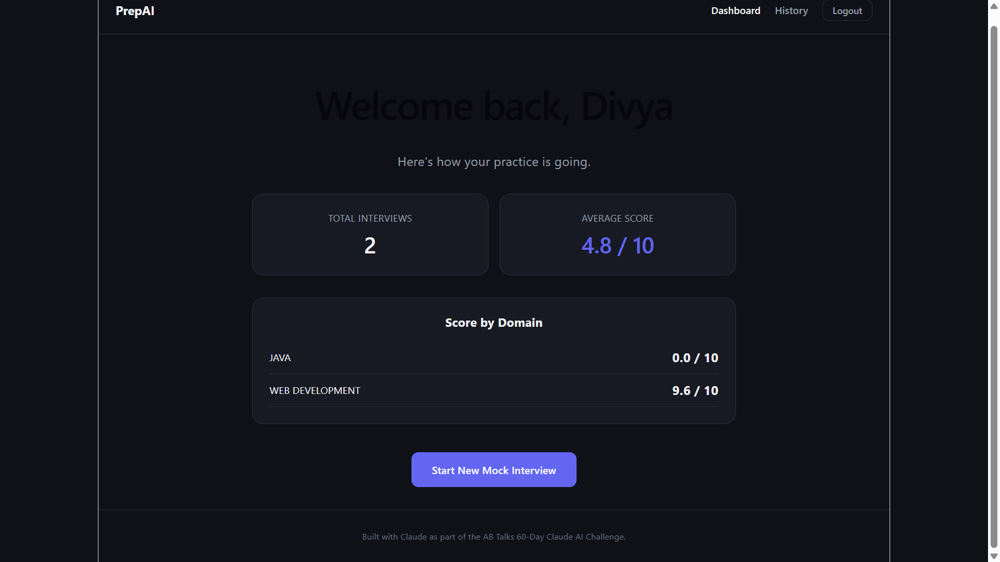
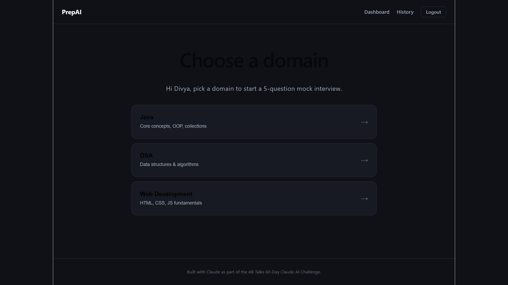
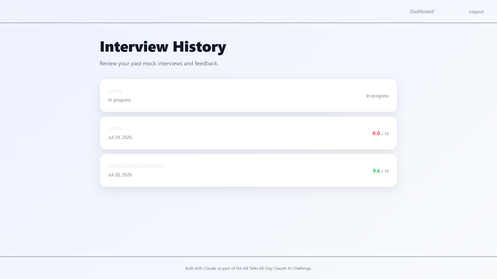

# PrepAI


**AI-powered mock interview practice — get real interview questions and instant, structured feedback on your answers, powered by Google Gemini.**

Practicing technical interviews alone is hard: static question banks don't tell you what you got wrong, and scheduling a human mock interviewer is a hassle. PrepAI solves this by generating fresh, domain-specific interview questions and giving you AI-scored feedback (strengths, weaknesses, and a concrete improvement tip) after every answer — so you can practice on your own schedule and actually improve.

🔗 **Live app:** [prepraai.netlify.app](https://prepraai.netlify.app)
🔗 **API:** [prepai-backend-cas5.onrender.com](https://prepai-backend-cas5.onrender.com)

---

## Screenshots

| Login                                | Dashboard                                    |
| ------------------------------------ | -------------------------------------------- |
|  |  |

| Choose a Domain                                      | Interview History                        |
| ---------------------------------------------------- | ---------------------------------------- |
|  |  |

---

## Features

- 🔐 Secure registration & login (JWT authentication, BCrypt password hashing)
- 🧠 AI-generated interview questions across **Java**, **DSA**, and **Web Development**
- 📝 Instant AI feedback on every answer — score, strengths, weaknesses, and an improvement tip
- 📊 Personal dashboard with average score and per-domain performance
- 📚 Full interview history with per-question review
- 📱 Responsive, dark-themed UI

## Tech Stack

| Layer    | Technology                                               |
| -------- | -------------------------------------------------------- |
| Frontend | React (Vite), React Router, Axios                        |
| Backend  | Java 17, Spring Boot 3, Spring Security, Spring Data JPA |
| Database | PostgreSQL                                               |
| AI       | Google Gemini API (free tier)                            |
| Auth     | JWT (stateless)                                          |
| Hosting  | Netlify (frontend) · Render (backend + database)         |

## Architecture

```
React (Netlify) → Spring Boot REST API (Render) → PostgreSQL (Render)
                                ↓
                      Google Gemini API (questions + feedback)
```

## Getting Started Locally

### Prerequisites

- Java 17+, Node.js 18+, PostgreSQL, a free [Google Gemini API key](https://aistudio.google.com/app/apikey)

### Backend

```bash
cd backend
# Create backend/src/main/resources/application-local.properties
# using backend/.env.example as a reference for the required values
mvn spring-boot:run "-Dspring-boot.run.profiles=local"
```

### Frontend

```bash
cd frontend
npm install
npm run dev
```

## Environment Variables

Copy `backend/.env.example` as a reference and create `backend/src/main/resources/application-local.properties` (gitignored) with your real values:

```
SPRING_DATASOURCE_URL=jdbc:postgresql://localhost:5432/prepai_db
SPRING_DATASOURCE_USERNAME=your_db_username
SPRING_DATASOURCE_PASSWORD=your_db_password
JWT_SECRET=generate_a_random_32_byte_base64_string
GEMINI_API_KEY=your_google_gemini_api_key
```

## Roadmap

See [`docs/future-scope.md`](docs/future-scope.md) for the 3/6/12-month product roadmap and [`docs/30-day-growth-plan.md`](docs/30-day-growth-plan.md) for the next 30 days of planned work.

## Project Journey

Built in a structured 10-day sprint as the capstone for the **AB Talks 60-Day Claude AI Challenge**. See [`docs/challenge-retrospective.md`](docs/challenge-retrospective.md) for the full build story, technical decisions, and lessons learned.

## License

MIT License

## Portfolio Highlights

- Built a complete full-stack AI application from scratch.
- Designed secure JWT authentication with Spring Security.
- Integrated Google Gemini API for dynamic interview generation and AI feedback.
- Deployed production-ready frontend and backend.
- Followed a complete Software Development Lifecycle (SDLC) from planning to deployment.

## Credits

Built by Divya Chauhan with [Claude](https://claude.ai) (free tier) as an AI pair programmer, as part of the [AB Talks](https://www.abtalks.in/) 60-Day Claude AI Challenge.- 🌐 Deployed on Netlify + Render for real-world production experience
